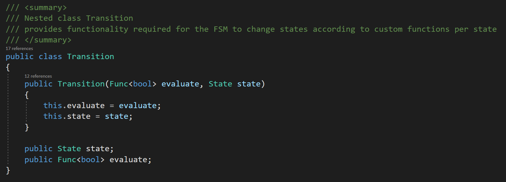
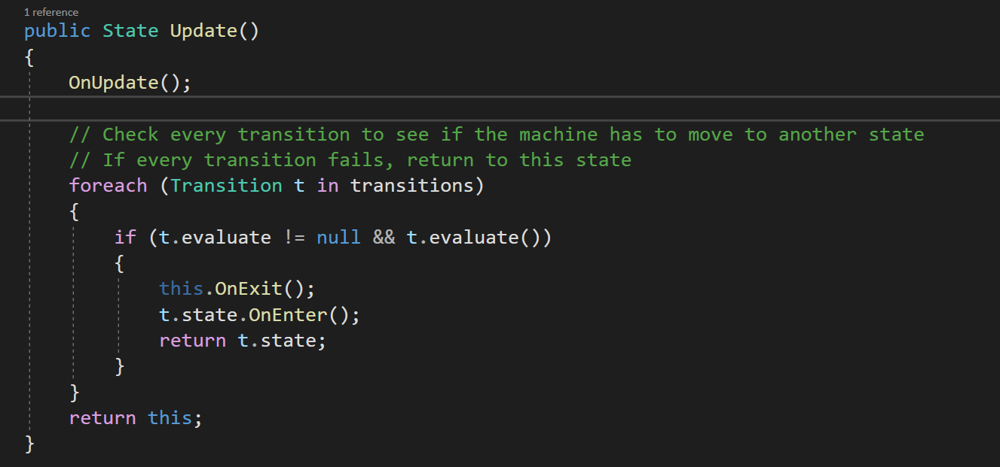
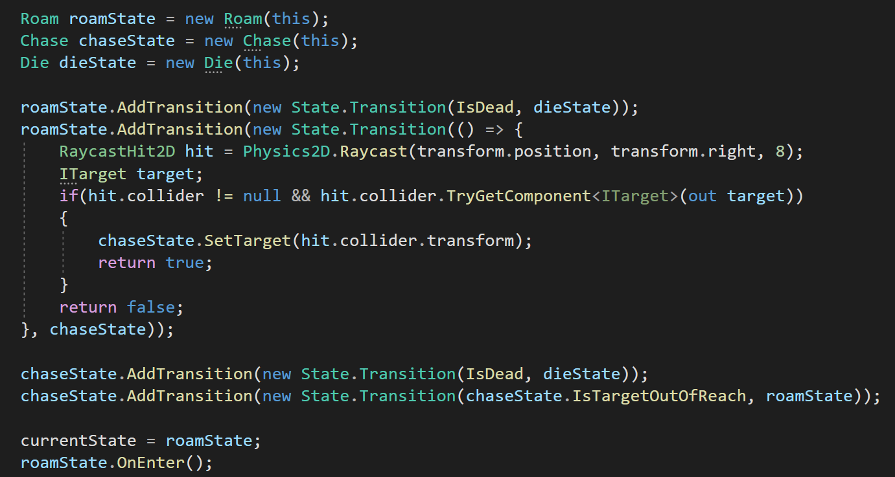
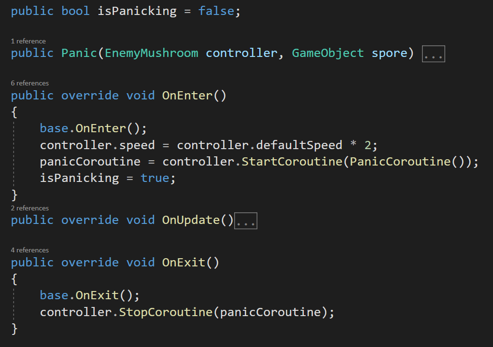
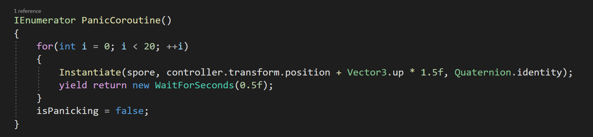
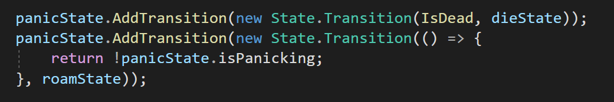
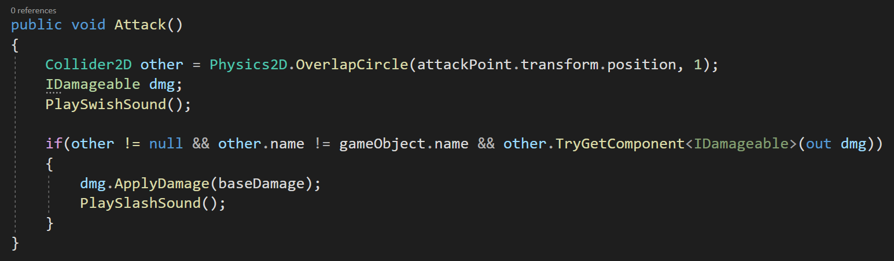
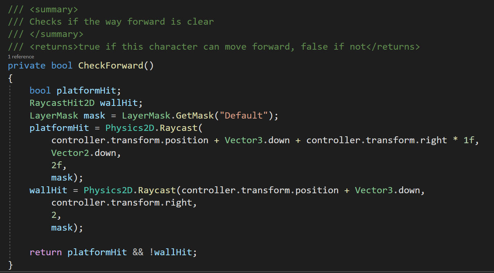

# Lost Templar

Actividad 2 del curso Desarrollo de Videojuegos 1.

Elaborado por: Rodolfo Mora-Zamora.

## Descripción del juego

- **Género:** Platformer 2D
- **Engine:** Unity 2022.3.27f1
- **Disponible en:** https://ceibasoft.itch.io/lost-templar 
- **Código disponible en:** https://github.com/Rjmoraza/LostTemplar 

El juego consiste en un único nivel de plataformas que incluye tres tipos de enemigos con diferentes comportamientos. El nivel se gana llegando al final y eliminando a los enemigos de la última arena.

## Máquina de Estados Finitos

La inteligencia artificial de los enemigos se implementaron usando máquinas de estados finitos que implementan una lista de transiciones que se almacena en un List<>. Esto permite mayor flexibilidad, ya que cada estado es independiente de sus transiciones. Podemos tener estados totalmente personalizados que están contenidos dentro del objeto que los requiere, y combinarlos con estados generales que todos los objetos pueden usar.

Cada transición tiene una función 

La clase Transition tiene una función delegada **evaluate** que se encarga de decidir si la transición se dispara o no. También incluye una referencia a un estado el cual sería al que la transición cambiaría si su evaluate retorna verdadero.

La clase State es una clase abstracta que incluye un método no sobrecargable llamado **Update**, el cual ejecuta la lógica del estado por ciclo y evalúa todas sus transiciones:

Incluye también tres métodos sobrecargables: 

- **OnEnter:** cuya función es modificar el estado de la entidad que controla para que tenga las condiciones necesarias para que el estado pueda funcionar correctamente. Este método por defecto viene vacío y no es obligatorio sobrecargarlo. 
- **OnUpdate: ** cuya función es ejecutar la lógica propia del estado. Este método es abstracto y debe sobrecargarse.
- **OnExit:** cuya función es limpiar cualquier dato o recurso que se necesite abandonar una vez que el estado deja su ejecución. Este método por defecto viene vacío y no es obligatorio sobrecargarlo.

## Clase Enemy

Todos los enemigos heredan de la clase abstracta Enemy que implementa la interfaz IDamageable. Esta clase contiene los atributos y lógica base para que un enemigo funcione correctamente. Cada enemigo es una máquina de estados, por lo que incluye un atributo *currentState* que corresponde al estado actualmente activo:

- **maxHitPoints**: representa la vida máxima de un enemigo.
- **hitPoints**: representa la vida actual de un enemigo.
- **currentState**: estado activo de la máquina de estados.
- **rb**: es una referencia al Rigidbody2D del enemigo.
- **Initialize()**: es un método abstracto que permite construir al enemigo, se ejecuta por defecto en el Start. Este método será utilizado como constructor y se encargará de crear la máquina de estados además de todo lo que requiera el enemigo para funcionar.
- **Move()** es un método que permite a este enemigo moverse en una dirección usando su Rigidbody2D. 
- **IsDead()**: es un método simple que verifica si los hitPoints del enemigo son <= 0. (Este método debería migrarse a la interfaz IDamageable).

### Ejemplo de una implementación de Enemy

La clase EnemySkeleton hereda de la clase Enemy e implementa en su **Initialize** la lógica necesaria para que el enemigo funcione correctamente. Dentro del **Initialize** encontramos la lógica de creación de la máquina de estados: 

Los estados **Roam** y **Chase** son propios de la clase **EnemySkeleton** y fueron definidos como clases anidadas privadas dentro de **EnemySkeleton**, mientras que el estado **Die** es un estado genérico que todos los enemigos actuales pueden compartir. Nótese como, al añadir las transiciones, se pueden utilizar funciones anónimas, funciones existentes de la clase **EnemySkeleton** o de la clase **Enemy** y funciones propias de los estados. Esto permite mucha flexibilidad y mantiene una arquitectura débilmente acoplada en la cual no es indispensable que los estados tengan referencias entre sí, y tampoco es indispensable que cada enemigo mantenga una referencia a sus estados. Con sólo crearlos y garantizar que estén conectados por sus transiciones la máquina funciona correctamente.

Importante mencionar que el orden en que se añaden las transiciones es muy importante, ya que se evalúan en orden de creación. Por esta razón todos los estados añaden primero una transición al estado Die antes de sus otras transiciones, dado que para la correcta lógica del juego es indispensable que las transiciones al estado Die tengan prioridad. Nótese además como no se añaden transiciones al estado Die, ya que este es un nodo final de la máquina.

## Uso de corutinas en los estados

Algunos estados aprovechan el ciclo de Update de Unity para funcionar, otros tienen transiciones que dependen del tiempo o ciclos paralelos que deben resolverse además del Update. Por esta razón algunos estados tienen corutinas implementadas. Es importante recalcar que al usar corutinas se corre el riesgo que una quede funcionando aún cuando ese estado no está vigente. Para garantizar el adecuado funcionamiento de las corutinas se tomaron las siguientes precauciones: 

- La corutina se arranca en el OnEnter del estado. Se guarda su referencia en los atributos del estado.
- La corutina se detiene en el OnExit del estado, usando la referencia guardada previamente.

El atributo **controller** es una referencia al **Enemy** al cual pertenece esta máquina de estados. Por tanto la corutina pertenece al **Enemy** que la creó. En este caso la corutina **PanicCoroutine()** lleva un temporizador que cuando acaba cambia la bandera **isPanicking** que se utiliza en la transición que sale de este estado.

## Uso de Interfaces y TryGetComponent

La interfaz **IDamageable** establece un mecanismo genérico que utilizan tanto el controlador del jugador (clase **Knight**) como los controladores de los enemigos (clase **Enemy**) para manejar el daño que reciben. Al implementarlo con una interfaz, los métodos de ataque implementados con **OverlapCircle** no requieren comparar etiquetas ni conocer la clase del objeto que está respondiendo al ataque, únicamente se consulta por la interfaz **IDamageable** y si esta existe se envía el mensaje con el daño correspondiente. 

Esto permite también un entorno débilmente acoplado, pero además abre la posibilidad a tener más tipos de objetos que responden al daño. Podría utilizarse en un futuro para tener elementos de escenario destruibles por ejemplo, o switches del escenario que responden a ataques, funcionalidades similares.

## Uso de Layers 

Varios comportamientos de los enemigos dependen de Layers para funcionar correctamente. Los enemigos no se bloquean mutuamente al caminar, ni se bloquean con el personaje jugable, además implementan máscaras de layer para evitar el friendly fire.

Por ejemplo el método **CheckForward()** de **EnemySkeleton** verifica que haya espacio adelante para caminar en el estado **Roam**. Esto permite un comportamiento en el cual el **EnemySkeleton** camina de un lado a otro aprovechando toda la plataforma que tiene bajo sus pies. Las verificaciones las realiza únicamente en el layer **Default** que es el que tiene asignado el escenario:

## Oportunidades de mejora

Durante la implementación se detectaron varios comportamientos que se repiten en todas las implementaciones de **Enemy**. Por ejemplo todas las implementaciones de **Enemy** tienen un **AudioSource**, un **Animator** y un **Rigidbody2D**, sin embargo sólo el Rigidbody2D está definido en la súperclase, lo cual produce cierta repetición de código. Hay algunos puntos más en los que se requiere refactorizar código para eliminar repeticiones y corregir algunos errores.

## Recursos Externos

Se utilizaron recursos visuales y de audio de las siguientes fuentes:

- https://aamatniekss.itch.io/fantasy-knight-free-pixelart-animated-character
- https://penusbmic.itch.io/free-dungeon-ruins-tileset
- https://luizmelo.itch.io/monsters-creatures-fantasy
- https://opengameart.org/content/zombie-spider-and-monster
- https://opengameart.org/content/swishes-sound-pack
- https://opengameart.org/content/fleshy-fight-sounds
- https://opengameart.org/content/cave-theme
- https://aamatniekss.itch.io/fantasy-knight-free-pixelart-animated-character